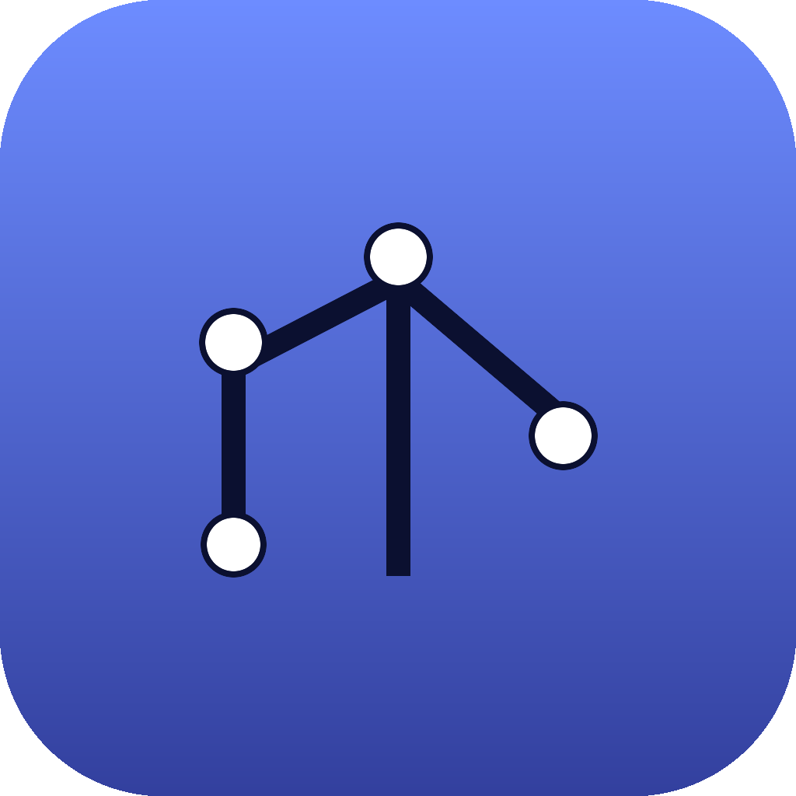

<div align="center">
  
  <h1>ArchMind</h1>
  <p><strong>Analizza progetti software esistenti e genera documentazione tecnica sempre aggiornata.</strong></p>
  <p>Reverse engineering · diagrammi automatici · analisi database · assistente che conosce il progetto.</p>
  <p>Rust + Tauri + Svelte · Windows · Linux · macOS (Apple Silicon)</p>
</div>

---

ArchMind apre una cartella di progetto, ne scansiona il codice, le API, i
container, i manifest e il database, e ricostruisce l'**architettura** in un
unico modello da cui genera **documentazione**, **diagrammi** e risposte a
domande sul funzionamento dell'applicazione.

Tutto gira in locale: il codice sorgente non lascia la macchina (le funzioni
AI cloud sono opt-in).

## Cosa analizza

- **Repository Git** — metadati del repo
- **C#** (`.cs`, `.csproj`) e **Java** (`.java`, `pom.xml`, Gradle) — namespace,
  package, classi, interfacce, metodi, dipendenze
- **Database** — DDL SQL (Oracle/PostgreSQL): tabelle, colonne, chiavi esterne
- **OpenAPI / Swagger** — endpoint (metodo, path, operationId)
- **Docker Compose** — servizi, immagini, porte, `depends_on`
- **Kubernetes** — Deployment, Service, ecc.
- **File di configurazione** — `.env`, `appsettings.json`, `application.properties/yml`
- **Dipendenze** — NuGet, Maven, npm

## Cosa genera

- **Documentazione** Markdown (HTML/PDF/Wiki in roadmap)
- **Diagrammi** Mermaid: dependency graph, component, **ER**, class diagram, sequence
- **Ricerca** full-text su tutto il progetto
- **Assistente** (RAG, da V1): chat con il progetto

## Funzionalità (MVP / roadmap)

| Area | MVP | Roadmap |
|---|---|---|
| Reverse engineering | C#/Java euristici, deps, servizi, DDL | tree-sitter, DB live, Roslyn |
| Documentazione | Markdown | HTML, PDF, Wiki |
| Diagrammi | Mermaid (5 tipi) | PlantUML, Graphviz |
| Knowledge | ricerca full-text | indicizzazione + RAG con citazioni |
| Evoluzione | — | confronto versioni, analisi d'impatto |

Dettagli completi (architettura, modello dati, API, indicizzazione, AI,
roadmap MVP→V1→V2→Enterprise): **[docs/ARCHITECTURE.md](docs/ARCHITECTURE.md)**.

## Sviluppo

Prerequisiti: [Rust](https://rustup.rs), [Node 20+](https://nodejs.org) e le
dipendenze Tauri per il tuo SO ([guida](https://tauri.app/start/prerequisites/)).

```bash
npm install
npm run tauri dev      # avvia l'app in sviluppo
npm run tauri build    # crea i pacchetti per il tuo SO
```

Il "cervello" è in `core/` (crate Rust puro, senza Tauri): la stessa logica
potrà alimentare in futuro una CLI e un server headless.

## Build & release

Il workflow [`.github/workflows/release.yml`](.github/workflows/release.yml)
compila e pubblica a ogni tag `v*`:

- **Linux** — `.AppImage`, `.deb`, `.rpm`
- **Arch Linux** — `.pkg.tar.zst` (job dedicato via `makepkg`)
- **Windows** — `.exe` (NSIS) e `.msi`
- **macOS** — Apple Silicon (M1+)

```bash
git tag v0.1.0 && git push origin v0.1.0   # avvia la release (draft)
```

## Licenza

MIT
